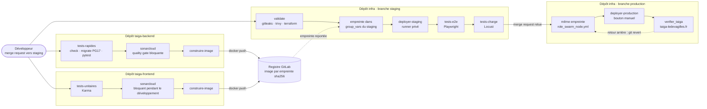

# CI/CD de Taiga

Trois dépôts, trois pipelines, une seule promotion : l'image construite et testée en staging est déployée telle quelle en production, désignée par son empreinte.

```mermaid
flowchart LR
  dev([Développeur<br/>merge request vers staging])

  subgraph back[Dépôt taiga-backend]
    bt[tests-rapides<br/>check · migrate PG17 · pytest] --> bq[sonarcloud<br/>quality gate bloquante] --> bb[construire-image]
  end

  subgraph front[Dépôt taiga-frontend]
    ft[tests-unitaires<br/>Karma] --> fq[sonarcloud<br/>bloquant pendant le développement] --> fb[construire-image]
  end

  reg[(Registre GitLab<br/>image par empreinte sha256)]

  subgraph staging[Dépôt infra · branche staging]
    iv[validate<br/>gitleaks · trivy · terraform] --> ref[empreinte dans<br/>group_vars du staging] --> ds[deployer-staging<br/>runner privé] --> e2e[tests-e2e<br/>Playwright] --> ch[tests-charge<br/>Locust]
  end

  subgraph production[Dépôt infra · branche production]
    img[même empreinte<br/>role_swarm_node.yml] --> dp[deployer-production<br/>bouton manuel] --> vp[verifier_taiga<br/>taiga-ledevagilles.fr]
  end

  dev --> bt & ft & iv
  bb & fb -->|docker push| reg
  reg -.->|empreinte reportée| ref
  ch -->|merge request relue| img
  vp -.->|retour arrière : git revert| img
```
